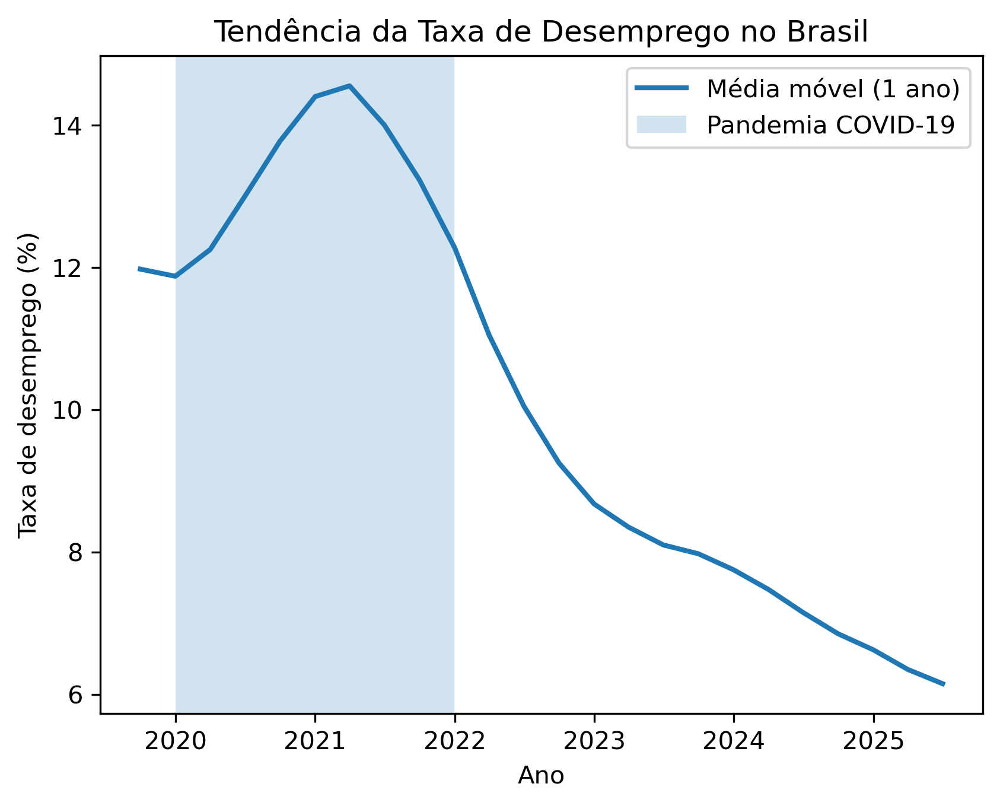

# 📊 Análise da Taxa de Desemprego no Brasil

## 🎯 Sobre o Projeto

Este projeto foi desenvolvido com o objetivo de praticar análise de dados utilizando informações reais sobre a taxa de desemprego no Brasil.

A ideia foi trabalhar com dados públicos do IBGE para entender como o desemprego evoluiu ao longo do tempo e aplicar técnicas de tratamento e visualização de dados em Python.

---

## 🗂 Fonte dos Dados

- IBGE (Instituto Brasileiro de Geografia e Estatística)  
- PNAD Contínua – dados públicos

---

## 🛠 Tecnologias Utilizadas

- Python  
- Pandas  
- Matplotlib  
- Jupyter Notebook  

---

## 🔎 O que foi feito

- Leitura e organização dos dados  
- Tratamento e padronização das informações  
- Conversão para formato de série temporal  
- Aplicação de média móvel para suavizar variações mensais  
- Criação de gráfico para visualizar a tendência ao longo do tempo  

---

## 📈 Resultado

A utilização da média móvel ajudou a reduzir variações mensais muito pequenas e deixou mais clara a tendência geral da taxa de desemprego ao longo dos anos.

---

## 💡 O que aprendi com este projeto

- Trabalhar com dados reais exige organização e atenção aos detalhes  
- Pequenas variações podem distorcer a interpretação se não forem tratadas corretamente  
- Visualização de dados é tão importante quanto a análise  
- Estruturar um projeto para portfólio exige clareza e organização  

---

## 🚀 Como Executar o Projeto

1. Clone o repositório: git clone https://github.com/LucasCHabib/analise-desemprego-brasil.git
2. Instale as dependências: pip install pandas matplotlib re
3. Execute o notebook: jupyter notebook

---

## 👨‍💻 Autor

Lucas Habib
Estudando e desenvolvendo habilidades práticas em Análise de Dados.
